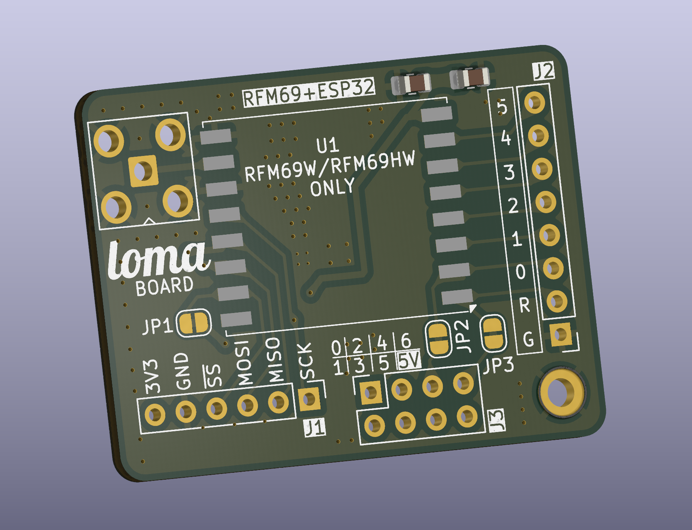

# loma-board

A breakout board for HopeRF RFM69, and (optionally) Seeed Studio Xiao ESP32C6.

## Quickstart

- Solder HopeRF's RFM69W or RFM69HW to the front.
- Solder Seeed Studio Xiao ESP32C6 to the back.
- Solder an antenna - see below. Do not use without an antenna.
- Use USB-C for power. The 3V3 regulator on the Xiao is enough to power the RFM69 module as well.

## Pinout

Default connections between ESP32 and RFM69:

| Jumper | RFM69 Pin | ESP32 Pin |
| ------ | --------- | --------- |
| JP1 | NSS | D7 |
| JP2 | DIO0 | D4 |
| JP3 | RST | D6 |

You can cut the jumpers if you don't want some/all of these to be connected.

All digital I/O pins from sides of the ESP32 module, and all DIO pins from the RFM69 module are broken out to pin headers.

## Antenna

Never use a radio without an antenna. You can either:

- start simple: just solder a piece of wire to the middle hole of the antenna connector.

  Internet never fully agrees on what length works best, so do your own research. I'd recommend trying 8.63 cm for 868 Mhz, 8.19 cm for 915 MHz, 17.31 cm for 433 MHz. These are approximately a quarter length of the wavelength. Wire diameter does not really matter.

- step-up from above: but instead of DIY, solder a small helical antenna. They look like small springs.

- go all-in: solder a SMA connector and use a proper antenna if you need better reception.

## Q&A

### Can I use RFM69CW or RFM69HCW?

No, they are not pin-compatible with RFM69(H)W.

### I want a different MCU / don't want Xiao ESP32C6

You can also use the board as merely a breakout board for RFM69, and do not place the ESP32 module at all. If you do that, use J1 header to power the radio module and connect the SPI pins to the MCU of your choice. Bonus points - if you use an angled pin header for J1, you can use it with a breakboard, too.

### Can I use another Xiao module?

They should be generally pin-compatible, so something like their ESP32S3 would probably work. Hovewer, the pads under the module are located differently - so isolate the bottom side of the module from the pads on the breakout board to avoid shorts.

### How to solder the Xiao module to the board?

None of the small pads under the Xiao module are actually used by the board - and they are not broken out to pin headers. The battery connector is unused but the "BAT-" pad is connected to ground. It's worth to try soldering the thermal pad. Soldering remaining pads is optional and would only increase mechanical strength of the connection between the board and the module.

### What to do with WiFi antenna?

By default, Xiao module will use the on-board ceramic antenna.

### What does the name mean?

I thought the board with a long SMA antenna looks somewhat like an ant-eater. "loma" is apparently the word for it in Swahili. It's also not "lora" which is kind of the point, but at the same time it is so similar...

## Schematics

<a property="dct:title" rel="cc:attributionURL" href="https://github.com/mlukaszek/loma-board/">Loma Board</a> is licensed under <a href="https://creativecommons.org/licenses/by-sa/4.0/?ref=chooser-v1" target="_blank" rel="license noopener noreferrer" style="display:inline-block;">CC BY-SA 4.0</a>

## Gerbers

Get them from a subfolder in the repository.